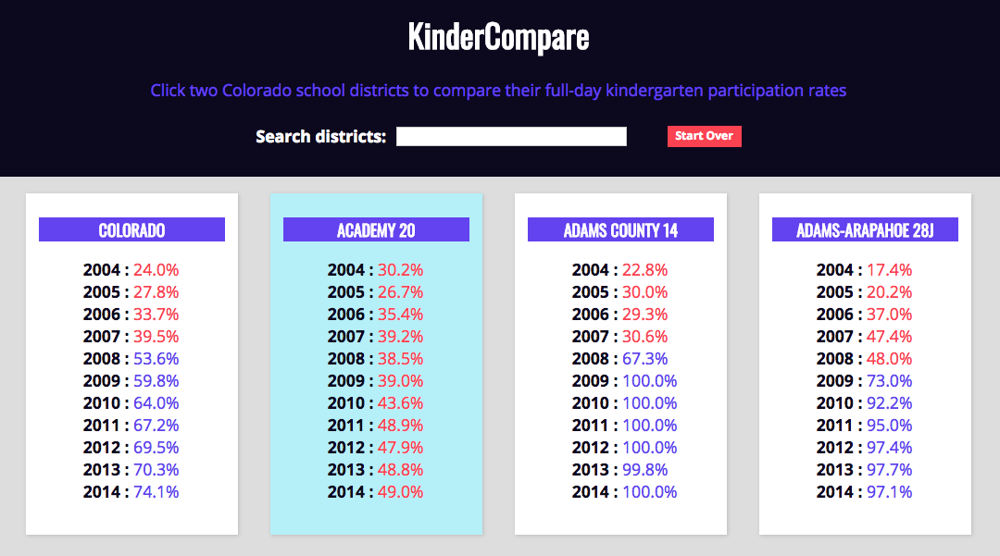
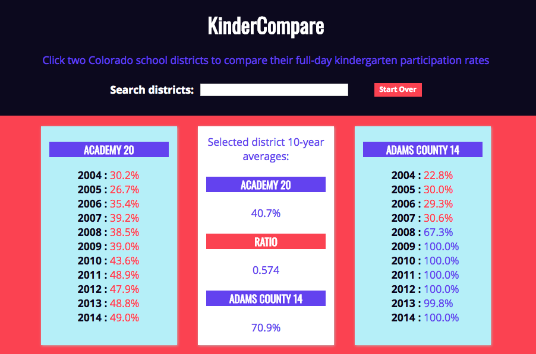

# HeadCount 2.0

HeadCount 2.0 is a project designed to show a comparison between data sets, in this case kindergarten participation rates by Colorado school district. This application was built using the `create-react-app` boilerplate. 

## Set Up

Fork this project

Run `npm install` from the root directory

Run `npm start` and visit localhost:3000 in your browser

## Project Goals

* Separate application logic into small, testable functions.
* Create modular, reusable React components.
* Use propTypes to validate props passed to each component.
* Write meaningful, comprehensive unit and integration tests with Jest and Enzyme.
* Make a visually appealing and useful app with a fully responsive design.

## Project Requirements

This app meets the following criteria:  

1. Users should be able to click on an individual district.
2. Once clicked, there should be a visual indication in the UI that the district has been clicked.
3. If clicked a second time, the district should revert back to its previous state.  
4. Once a district is selected, it must be displayed at the top of the page. It should also remain in the collection of districts displayed in the main body of the app.  

Example:  

  

5. Once two districts have been clicked, there should be a comparative analysis between the two.  

  
